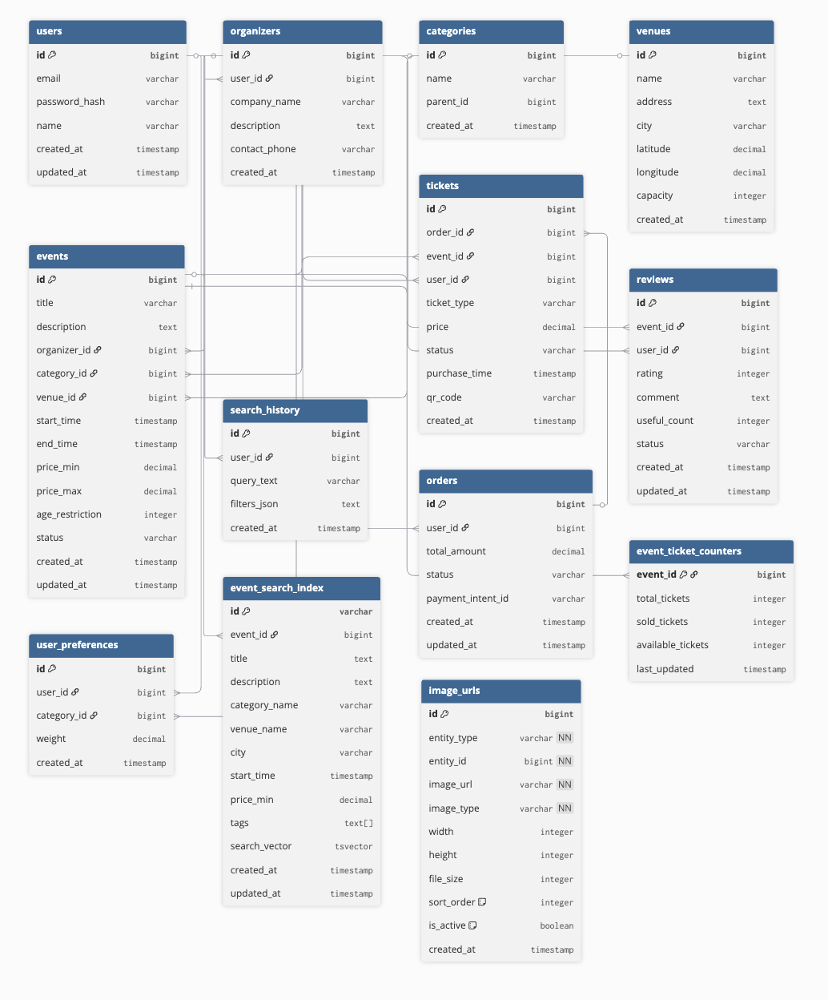
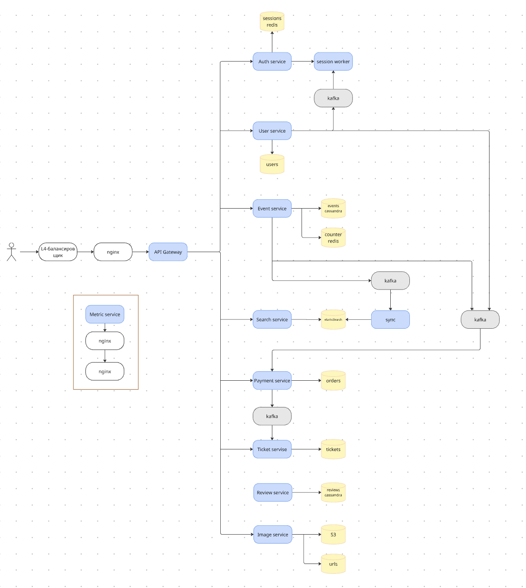

# Проектирование высоконагруженной платформы: Яндекс Афиша

## 1. Концепция и целевая аудитория

**Суть проекта:** B2C-сервис (SaaS) для агрегации культурных и развлекательных событий, оснащенный алгоритмами персонализации и модулем онлайн-торговли билетами.

### Ключевые конкуренты
*   Timepad
*   Kassir.ru
*   Яндекс Афиша

### Минимально жизнеспособный продукт (MVP)
*   **Умный поиск:** Фильтрация контента по тематике, временным рамкам, геолокации и ценовому диапазону.
*   **E-commerce:** Полный цикл покупки билетов с интеграцией платежных шлюзов и генерацией цифровых пропусков.
*   **Управление доступом:** Регистрация пользователей и авторизация через сторонние сервисы или email.
*   **Панель организатора:** Инструментарий для создания и редактирования афиши событий.
*   **Социальные доказательства:** Система рейтингования (шкала 1–5) и комментариев от посетителей.
*   **Персонализация:** Динамическая главная страница с подборкой мероприятий на основе поведения пользователя.

### Стратегические технические решения
*   **Микросервисная структура:** Разделение логики на независимые блоки (Поиск, Рекомендации, Билетная система, Профили, Каталог).
*   **Стратегия кеширования:** Интенсивное использование Redis для ускорения доступа к популярным событиям и статичному контенту.
*   **Асинхронность:** Обработка критических операций (платежи, выдача билетов) через очереди сообщений для повышения отказоустойчивости.
*   **ML-движок:** Алгоритмы машинного обучения для формирования индивидуальных рекомендаций.
*   **Геоинтеграция:** Связь с картографическими сервисами для точного отображения локаций.

### Портрет пользователя

| Показатель | Значение | Источники данных |
| :--- | :--- | :--- |
| **MAU** | 8 млн активных пользователей в месяц | SimilarWeb, внутренние данные экосистемы |
| **DAU** | 1.6 млн ежедневных пользователей | Расчетная конверсия (~20% от MAU) |
| **География** | РФ (85%), СНГ (10%), Мир (5%) | Аналитика трафика |
| **Демография** | Жители городов, возраст 18–45 лет | Отраслевые исследования |

---

## 2. Расчет нагрузки

### Продуктовые показатели

| Метрика | Значение | Логика расчета |
| :--- | :--- | :--- |
| **Сессии/день на юзера** | 1.2 | Пользователи планируют досуг 2–3 раза в неделю |
| **Время одной сессии** | 8 минут | Данные конкурентной среды |
| **Просмотров за сессию** | 12 шт. | Переходы между страницей поиска и карточками |
| **Конверсия в продажу** | 5% | Средний показатель для event-агрегаторов |
| **Частота покупок** | 1.5 в месяц | Оценка лояльности платящей аудитории |
| **Размер JSON-ответа** | ~15 КБ | Текстовые данные без медиафайлов |

### Прогноз масштабирования (горизонт 2 года)
*   **Текущая база:** 8 млн MAU.
*   **Темп роста:** +20% ежегодно.
*   **Прогноз через год:** 9.6 млн MAU.
*   **Прогноз через два года:** 11.52 млн MAU.

### Объемы хранения данных

| Категория данных | Кол-во записей | Размер одной записи | Общий объем |
| :--- | :--- | :--- | :--- |
| **Профили пользователей** | 11.5 млн | 5 КБ | 57.6 ГБ |
| **Мероприятия (акт./арх.)** | 3 млн | 50 КБ | 150 ГБ |
| **Медиафайлы (фото)** | 15 млн | 500 КБ | 7.5 ТБ |
| **Отзывы и оценки** | 40 млн | 2 КБ | 80 ГБ |
| **Выданные билеты** | 38.4 млн | 10 КБ | 384 ГБ |
| **История заказов** | 38.4 млн | 5 КБ | 192 ГБ |
| **ВСЕГО** | — | — | **~8.4 ТБ** |

### Анализ сетевого трафика

| Вид трафика | Средняя нагрузка (ГБ/сутки) | Пиковая нагрузка (Гбит/с) |
| :--- | :--- | :--- |
| Запрос карточки события | 460.8 | 42.7 |
| Чтение отзывов | 175.8 | 16.3 |
| Поисковые запросы | 4.9 | 0.45 |
| Транзакции покупки | 1.5 | 0.14 |
| CDN (загрузка изображений) | 36.0 | 3.3 |
| **Итого исходящий** | **~212 ГБ** | **~19.6 Гбит/с** |
| **Итого входящий** | **~467 ГБ** | **~43.2 Гбит/с** |

### Производительность (RPS — запросов в секунду)

| Операция API | Средний RPS | Пиковый RPS (коэффициент x5) |
| :--- | :--- | :--- |
| Поиск событий (`GET /search`) | 44.4 | 222 |
| Просмотр деталей (`GET /{id}`) | 267 | 1335 |
| Оформление заказа (`POST /purchase`) | 1.9 | 9.5 |
| Получение рекомендаций (`GET /recs`) | 44.4 | 222 |
| Создание события (`POST /events`) | 0.9 | 4.5 |
| **Общая сумма** | **~359 RPS** | **~1793 RPS** |

### Детализация вычислений нагрузки

База расчетов: **1.6 млн DAU**.

1.  **Просмотр контента (`GET /events/{id}`):**
    *   Суточный объем: $1.6\text{ млн} \times 1.2 \times 12 = 23.04\text{ млн}$ запросов.
    *   Нагрузка в секунду: $23.04\text{ млн} / 86\,400 \approx 267$ RPS.

2.  **Поиск и умные рекомендации (`GET /events/search, GET /recommendations`)::**
    *   Суточный объем (на каждый тип): $1.6\text{ млн} \times 1.2 \times 2 = 3.84\text{ млн}$ запросов.
    *   Нагрузка в секунду: $3.84\text{ млн} / 86\,400 \approx 44.4$ RPS.

3.  **Покупка билетов (`POST /tickets/purchase`):**
    *   Количество транзакций в день: $1.6\text{ млн} \times 5\% = 80\,000$.
    *   Учет двойного запроса (корзина + оплата): $80\,000 \times 2 = 160\,000$.
    *   Нагрузка в секунду: $160\,000 / 86\,400 \approx 1.85$ (округлено до 1.9 RPS).

## 3. Глобальная балансировка нагрузки

#### 3.1. Функциональное разбиение по доменам

- **`api.afisha.ru`** (основное API): Пользователи, Мероприятия, Поиск, Комментарии
- **`pay.afisha.ru`** (платежный шлюз): Обработка платежей, выпуск билетов
- **`cdn.afisha.ru`** (контентная сеть): Обслуживание изображений мероприятий, статических assets

#### 3.2. Обоснование расположения ДЦ

**Главная задача:** Обеспечить низкую задержку при поиске мероприятий и покупке билетов, так как это напрямую влияет на конверсию и удовлетворенность пользователей.

**Распределение аудитории и расположение ДЦ:**
- **85% трафика (Россия):** Основная аудитория
    - **ДЦ-1 (Москва):** Обслуживает Центральный регион
    - **ДЦ-2 (Санкт-Петербург):** Обслуживает Северо-Запад и часть Европы
    - **ДЦ-3 (Екатеринбург):** Обслуживает Уральский регион и часть Сибири
- **10% трафика (СНГ):**
    - **ДЦ-4 (Казахстан, Алматы):** Обслуживает Среднюю Азию

#### 3.3. Схема DNS балансировки

Используем **Latency-based (GeoDNS) Routing**
- Пользователь запрашивает `api.afisha.ru`
- DNS-провайдер определяет его местоположение и возвращает IP-адрес того ДЦ, который имеет наименьшую сетевую задержку
- Например, пользователь из Новосибирска будет направлен в ДЦ-3 (Екатеринбург)

#### 3.4. Схема Anycast балансировки

**Anycast** идеально подходит для `cdn.afisha.ru` и `pay.afisha.ru`
- **Для CDN:** Один IP-адрес анонсируется всеми ДЦ. Пользователь всегда попадает на ближайший узел
- **Для платежного шлюза:** Anycast обеспечивает отказоустойчивость. Если один ДЦ недоступен, трафик автоматически перенаправляется

#### 3.5. Механизм регулировки трафика между ДЦ

- **Балансировка чтения:** Поисковые запросы и запросы на просмотр мероприятий обрабатываются ближайшим ДЦ
- **Балансировка записи:** Запросы на создание мероприятий и покупку билетов перенаправляются в основной ДЦ (Москва) для консистентности
- **Active-Active:** Все ДЦ активно обрабатывают запросы

## 4. Локальная балансировка нагрузки

#### 4.1. Схема балансировки нагрузки

Используем многоуровневую схему для отказоустойчивости и эффективного распределения нагрузки

**Уровень 1:** L4 Load Balancer (HAProxy) - TCP-балансировка, SSL Termination  
*(Схема резервирования: Active/Active)*  
**Уровень 2:** L7 Load Balancer (Nginx Ingress) - HTTP-маршрутизация, кеширование  
*(Схема резервирования: N+1)*  
**Уровень 3:** Kubernetes Service (kube-proxy) - Внутрикластерная балансировка  
**Уровень 4:** Pods (микросервисы) - Поиск, Билеты, Пользователи, Рекомендации...

```
Интернет → L4 LB → L7 LB → kube-proxy → Pods
```


**Формула резервирования: N+1**
- На каждом уровне развертывается на один узел больше, чем требуется для обработки пиковой нагрузки

#### 4.2. Расчёт количества балансировщиков

**Исходные данные:**
- **Пиковый RPS:** ~1793 RPS
- **Пиковый трафик (входящий):** ~43.2 Гбит/с

**Ограничивающие факторы для L7-балансировщиков (Nginx):**
1. **SSL Termination:** ~10,000 CPS на 24 CPU
2. **Пропускная способность сети:** 10 Гбит/с на сетевой интерфейс

**Расчет по пропускной способности сети:**
- Пиковый входящий трафик: ~43.2 Гбит/с
- Пропускная способность одного балансировщика: 10 Гбит/с
- **Необходимое количество для обработки трафика:** 43.2 / 10 = 4.32 → **5 балансировщика**

**Применяем схему резервирования N+1:**
- Для обработки трафика нужно 5 балансировщика
- Для отказоустойчивости добавляем 1 дополнительный
- **Итого необходимо L7-балансировщиков: 6**

Каждый балансировщик представляет собой виртуальную машину с 8-16 CPU, 16-32 ГБ ОЗУ и сетевым интерфейсом 10 Гбит/с.

## 5. Логическая схема БД



### 📋 Таблица с описанием сущностей

| Таблица | Назначение | Основные поля | Средний размер строки | QPS чтения / записи |
|---------|------------|---------------|----------------------|-------------------|
| users | Профили пользователей | id, email, name, avatar_url | ~500 Б | R: 50k / W: 5k |
| organizers | Организаторы мероприятий | id, user_id, company_name, contact_phone | ~300 Б | R: 10k / W: 1k |
| categories | Категории мероприятий | id, name, parent_id | ~100 Б | R: 5k / W: 100 |
| venues | Места проведения | id, name, address, city, coordinates | ~400 Б | R: 15k / W: 500 |
| events | Мероприятия | id, title, description, dates, prices | ~2 КБ | R: 200k / W: 20k |
| tickets | Билеты | id, event_id, user_id, price, status | ~300 Б | R: 80k / W: 15k |
| reviews | Отзывы и оценки | id, event_id, user_id, rating, comment | ~500 Б | R: 30k / W: 5k |
| user_preferences | Предпочтения для рекомендаций | id, user_id, category_id, weight | ~100 Б | R: 20k / W: 3k |
| search_history | История поиска | id, user_id, query_text, filters | ~400 Б | R: 10k / W: 8k |
| image_urls | Все изображения системы | id, entity_type, entity_id, image_url, image_type |
| orders | Заказы билетов | id, user_id, total_amount, status, payment_intent_id |

### ⚙️ Требования к консистентности

| Таблица | Модель консистентности | Обоснование |
|---------|------------------------|-------------|
| users | Strong | Данные аутентификации должны быть строго консистентны |
| organizers | Strong | Информация об организаторах критична для доверия |
| events | Strong | Актуальность информации о мероприятиях и билетах |
| tickets | Strong | Предотвращение продажи одних и тех же билетов |
| venues | Strong | Геоданные должны быть точными |
| reviews | Eventual | Отзывы могут реплицироваться с задержкой |
| user_preferences | Eventual | Предпочтения не критичны к мгновенной синхронизации |
| search_history | Eventual | История поиска допускает расхождения |

### 🔑 Распределение нагрузки по ключам

| Таблица | Ключи для распределения | Особенности |
|---------|-------------------------|-------------|
| users | id | Равномерное распределение по UUID |
| events | id + city | Географическое шардирование по городам |
| tickets | event_id | Группировка билетов по мероприятиям |
| reviews | event_id | Локализация отзывов по событиям |
| venues | city | Географическое распределение мест |
| search_history | user_id | Персонализация истории поиска |

## 6. Физическая схема БД

### 6.1 Выбор СУБД по таблицам

| Таблица | СУБД | Обоснование |
|---------|------|-------------|
| users | PostgreSQL | Strong consistency, сложные запросы профилей |
| organizers | PostgreSQL | Связь с пользователями, ACID-транзакции |
| categories | PostgreSQL | Статические данные, редко меняются |
| venues | PostgreSQL + PostGIS | Географические запросы |
| events | Cassandra | Высокая нагрузка чтения, географическое шардирование |
| event_search_index | Elasticsearch | Полнотекстовый поиск, фасетный поиск |
| image_urls | PostgreSQL + AWS S3 | Метаданные в PG, файлы в S3 + CDN |
| orders | PostgreSQL | Транзакционность заказов |
| tickets | PostgreSQL | Транзакционность, связь с заказами |
| event_ticket_counters | Redis | Atomic инкременты, быстрый доступ |
| reviews | Cassandra | Высокая частота записи отзывов |
| user_preferences | Redis | Быстрый доступ для рекомендаций |
| search_history | PostgreSQL | Структурированные данные, аналитика |

### 6.2 Индексы

```sql
-- PostgreSQL индексы
CREATE INDEX idx_users_email ON users(email);
CREATE INDEX idx_organizers_user_id ON organizers(user_id);
CREATE INDEX idx_venues_city ON venues(city);
CREATE INDEX idx_events_organizer ON events(organizer_id);
CREATE INDEX idx_events_category ON events(category_id);
CREATE INDEX idx_events_city_date ON events(city, start_time);
CREATE INDEX idx_tickets_event_user ON tickets(event_id, user_id);
CREATE INDEX idx_tickets_status ON tickets(status);
CREATE INDEX idx_reviews_event_rating ON reviews(event_id, rating);

-- Cassandra индексы (вторичные)
CREATE INDEX idx_events_city ON events(city);
CREATE INDEX idx_events_start_time ON events(start_time);
```

### 6.3 Денормализация

| Таблица | Денормализованные поля | Цель |
|---------|------------------------|------|
| events | venue_name, city, category_name | Ускорение поиска без JOIN |
| tickets | event_title, event_date, venue_name | Быстрое отображение в ЛК |
| reviews | user_name, event_title | Отображение без дополнительных запросов |
| user_preferences | category_names[] | Быстрые рекомендации |

### 6.4 Шардирование и резервирование

| Таблица | Тип шардирования | Резервирование |
|---------|------------------|----------------|
| users | user_id mod N | PostgreSQL: 1 master + 2 replicas |
| events | city (геошардирование) | Cassandra: RF=3, каждый регион |
| tickets | event_id mod N | PostgreSQL: шардирование по событиям |
| venues | city | PostgreSQL: географическое распределение |
| reviews | event_id mod N | Cassandra: RF=3 |
| search_history | user_id mod N | Elasticsearch: 3 реплики на шард |

### 6.5 Клиентские библиотеки / интеграции

- **PostgreSQL**: `psycopg2` (Python), `HikariCP` (Java)
- **Cassandra**: `cassandra-driver` (Python), `DataStax Java Driver`
- **Redis**: `redis-py`, `Lettuce` (Java)
- **Elasticsearch**: `elasticsearch-py`, `RestHighLevelClient` (Java)
- **AWS S3**: `boto3` (Python), `AWS SDK` (Java)

### 6.6 Балансировка запросов / мультиплексирование

- **PostgreSQL**: PgBouncer + HAProxy для connection pooling
- **Cassandra**: Token-aware load balancing в драйвере
- **Redis**: Redis Cluster с автоматическим шардированием
- **Elasticsearch**: Coordinating nodes для распределения запросов

### 6.7 Схема резервного копирования

| СУБД | Стратегия бэкапа | RTO/RPO |
|------|------------------|----------|
| PostgreSQL | WAL-архивирование + pgBackRest | RTO: 15 мин, RPO: 5 мин |
| Cassandra | Incremental snapshots + commitlog | RTO: 30 мин, RPO: 1 час |
| Redis | RDB snapshots + AOF | RTO: 5 мин, RPO: 1 мин |
| Elasticsearch | Snapshot to S3 | RTO: 20 мин, RPO: 15 мин |
| AWS S3 | Versioning + Cross-region replication | RTO: 1 мин, RPO: 0 |

**Расписание бэкапов:**
- Ежедневные полные бэкапы в 02:00
- Инкрементальные каждые 4 часа
- WAL-архивы каждые 5 минут
- Snapshot S3 - ежечасно

## 7. Алгоритмы

| Алгоритм | Область применения | Детальное описание |
|----------|-------------------|-------------------|
| **BM25 + TF-IDF** | Текстовый поиск мероприятий в Elasticsearch | **TF-IDF** вычисляет важность термина в документе относительно всей коллекции: термины, часто встречающиеся в конкретном мероприятии, но редко в других, получают высокий вес. **BM25** улучшает TF-IDF, нормализуя длину документов и добавляя гиперпараметры для регулирования влияния частоты терминов и длины поля. Формула: `score = IDF(q) * (TF(q) * (k1 + 1)) / (TF(q) + k1 * (1 - b + b * (длина_документа/средняя_длина)))`. **Решает задачу:** нахождения мероприятий по текстовому запросу |
| **Collaborative Filtering + Content-Based Filtering** | Система рекомендаций мероприятий | **Collaborative Filtering** строит матрицу пользователь-мероприятие на основе явных (оценки, покупки) и неявных (просмотры, клики) взаимодействий. Используется SVD (Singular Value Decomposition) или ALS (Alternating Least Squares) для предсказания вероятности посещения. **Content-Based Filtering** анализирует атрибуты мероприятий (категория, цена, локация, время) и сопоставляет с профилем предпочтений пользователя. Финальный скоринг: `score = α * CF_score + (1-α) * CB_score`, где α динамически настраивается по качеству рекомендаций для пользователя. **Решает задачу:** персональных рекомендаций без явного запроса |
| **Gradient Boosting** | Финальное ранжирование поисковой выдачи | Ансамблевая модель на основе решающих деревьев, где каждое последующее дерево обучается на ошибках предыдущих. Признаки: текстовная релевантность (BM25 score), популярность мероприятия, географическая близость, персональные предпочтения, временные паттерны, рейтинг мероприятия. Модель обучается на логах кликов с использованием LambdaMART loss function для оптимизации NDCG. **Решает задачу:** оптимального порядка показа найденных мероприятий |

**BM25** - находит мероприятия по тексту (что искать)  
**Gradient Boosting** - определяет порядок показа (как показывать)

## 8. Технологии

| Технология | Область применения | Мотивационная часть |
|------------|-------------------|---------------------|
| **Go** | Backend микросервисов (API, билеты, пользователи) | Высокая производительность (1793 RPS), эффективные горутины для параллельной обработки, низкое потребление памяти |
| **PostgreSQL** | Пользователи, заказы, билеты, метаданные | ACID-транзакции для финансовых операций, сложные SQL-запросы, надежная репликация |
| **Cassandra** | Мероприятия, отзывы | Линейная масштабируемость, высокая доступность, оптимизация под географическое шардирование |
| **Redis** | Кэш сессий, счетчики билетов, рекомендации | In-memory производительность (<1ms), атомарные операции для счетчиков, структуры данных для кэша |
| **Elasticsearch** | Поиск мероприятий, аналитика | Полнотекстовый поиск с морфологией, фасетный поиск по фильтрам, быстрый отклик (<100ms) |
| **AWS S3 + CloudFront** | Хранение и раздача изображений | Надежное хранение медиафайлов, глобальная CDN для быстрой доставки изображений |
| **Kubernetes** | Оркестрация микросервисов | Автомасштабирование под нагрузку, self-healing, rolling deployments для 24/7 доступности |
| **Nginx** | L7 балансировщик, SSL termination | Высокая производительность балансировки, кэширование статики, маршрутизация API |
| **Apache Kafka** | Асинхронная обработка событий | Горизонтальная масштабируемость очередей, гарантированная доставка событий аналитики |
| **Prometheus + Grafana** | Мониторинг и алертинг | Сбор метрик в реальном времени, дашборды для RPS/задержек, алерты при аномалиях |
| **Docker** | Контейнеризация сервисов | Единая среда разработки/продакшн, быстрое развертывание, изоляция зависимостей |
| **React + TypeScript** | Web-интерфейс | Быстрый рендеринг списков мероприятий, строгая типизация для сложного UI |
| **Two-Phase Commit** | Транзакции покупки билетов | Гарантирует атомарность операций: резервирование билетов → создание заказа → списание средств. Coordinator управляет участниками через prepare/commit phases |
| **LRU Cache** | Кэширование в Redis | Вытеснение наименее востребованных данных при достижении лимита памяти. Double-linked list + hash map для O(1) операций |
| **Token Bucket** | Rate limiting API | Ограничение запросов (300/мин на пользователя). Алгоритм поддерживает bucket с токенами, пополняемыми с фиксированной скоростью |
| **Consistent Hashing** | Шардирование в Cassandra | Распределение данных по узлам с минимальным перераспределением при изменении размера кластера. Виртуальные ноды для равномерной нагрузки |
| **Idempotency Key** | Платежные операции | Гарантирует однократное выполнение операции при повторных запросах. Ключ хранится в Redis с TTL и проверяется перед выполнением |

## 9. Обеспечение надёжности

## Stateful Graceful Shutdown для платежей
1. Load balancer на новые запросы
2. Завершение текущих транзакций (30 сек)
3. Проверка idempotency keys в Redis
4. Компенсирующие действия
5. Фиксация состояния в Kafka

## Асинхронная обработка с Outbox Pattern
- **Outbox + CDC (Debezium)** → Kafka → Consumers
- Атомарная запись в БД и очередь
- Снижение latency с 2-3с до 200-300мс
- Гарантированная доставка при недоступности consumers

## Graceful Degradation с приоритизацией
**Уровень 1: Search Service перегружен**
- Упрощенный поиск по названию + фильтрация Cassandra
- Кэш популярных запросов в Redis (5 мин TTL)

**Уровень 2: Payment Service недоступен**
- Режим "бронирования" билетов на 15 минут
- RPS снижается с 9.5 до 0.5

**Уровень 3: Cassandra деградирует**
- Чтение из Redis кэша (1000 популярных событий)
- Буферизация записи в Kafka

## 10. Схема взаимодействия сервисов


# 11. Расчёт ресурсов

## Расчёт для микросервисов

**Допущение:** Go сервис с средней бизнес-логикой обрабатывает 500 RPS на 1 CPU

| Микросервис | API Endpoint | Средний RPS | Пиковый RPS | CPU (cores) | RAM (GB) | Сетевой трафик |
|-------------|--------------|-------------|-------------|-------------|----------|----------------|
| Event Service | GET /events/{id} | 267 | 1335 | 2.67 | 0.53 | 42.7 Гбит/с |
| Search Service | GET /events/search | 44.4 | 222 | 0.44 | 0.09 | 0.45 Гбит/с |
| Recommendation Service | GET /recommendations | 44.4 | 222 | 0.44 | 0.09 | 0.45 Гбит/с |
| User Service | Auth + Profile | 50 | 250 | 0.5 | 0.1 | 0.5 Гбит/с |
| Ticket Service | POST /tickets/purchase | 1.9 | 9.5 | 0.02 | 0.004 | 0.14 Гбит/с |
| Payment Service | Payment processing | 1.9 | 9.5 | 0.02 | 0.004 | 0.14 Гбит/с |
| Review Service | Reviews + Ratings | 30 | 150 | 0.3 | 0.06 | 0.3 Гбит/с |
| **Итого** | **—** | **439.6** | **2198** | **4.39** | **0.88** | **44.8 Гбит/с** |

## Расчёт для баз данных

### PostgreSQL
**Нагрузка:** 360,000 QPS (чтение) + 45,000 QPS (запись) = 405,000 QPS  
**Объём данных:** 1.2 ТБ  
**CPU:** ⌈405,000 / 200⌉ = **2025 ядер** (1 ядро = 200 операций/сек)  
**RAM:** 256 ГБ (для данных >1 ТБ) × 64 сервера = **16 ТБ**  
**Конфигурация:** 64 × AMD EPYC 7313P (32 ядра, 256 ГБ RAM, 2 ТБ NVMe)

### Redis
**Нагрузка:** 200,000 QPS  
**CPU:** ⌈200,000 / 50,000⌉ = **4 ядра** (1 ядро = 50,000 операций/сек)  
**RAM:** 16 ГБ × 6 узлов = **96 ГБ**  
**Конфигурация:** 6 × AMD EPYC 7313P (2 ядра, 16 ГБ RAM)

### Cassandra
**Нагрузка:** 225,000 QPS × RF3 = 675,000 QPS  
**CPU:** ⌈675,000 / 10,000⌉ = **68 ядер** (1 ядро = 10,000 операций/сек)  
**RAM:** 64 ГБ × 20 узлов = **1.28 ТБ**  
**Конфигурация:** 20 × AMD EPYC 7313P (16 ядер, 64 ГБ RAM, 1 ТБ NVMe)

### Elasticsearch
**Нагрузка:** 222 RPS (пик)  
**CPU:** 42 ядра  
**RAM:** 168 ГБ  
**Конфигурация:** 6 серверов (3 master × 2CPU/8GB + 3 data × 8CPU/32GB)

## Выбор хостинга и конфигурации

### Модель развертывания: Гибридная
- **Stateless микросервисы:** Kubernetes на bare-metal
- **Stateful базы данных:** Bare-metal серверы
- **CDN/S3:** Облачное решение (AWS S3 + CloudFront)

### Конфигурация серверов

| Назначение | Хостинг | Конфигурация | Cores | RAM | Стоимость | Количество |
|------------|---------|--------------|-------|-----|-----------|------------|
| Kubenode | Bare-metal | 2×AMD EPYC 7313P/128GB/2×NVMe2TB | 32 | 128 GB | $3,200 | 14 |
| PostgreSQL | Bare-metal | 2×AMD EPYC 7313P/256GB/2×NVMe2TB | 32 | 256 GB | $4,500 | 64 |
| Cassandra | Bare-metal | AMD EPYC 7313P/64GB/1×NVMe1TB | 16 | 64 GB | $2,000 | 20 |
| Redis | Bare-metal | AMD EPYC 7313P/16GB/1×NVMe500GB | 16 | 16 GB | $1,200 | 6 |

### Итоговые ресурсы

| Компонент | Серверы | Всего CPU | Всего RAM | Стоимость оборудования |
|-----------|---------|-----------|-----------|------------------------|
| Микросервисы | 14 | 448 ядер | 1.79 ТБ | $44,800 |
| PostgreSQL | 64 | 2048 ядер | 16 ТБ | $288,000 |
| Cassandra | 20 | 320 ядер | 1.28 ТБ | $40,000 |
| Redis | 6 | 96 ядер | 96 ГБ | $7,200 |
| Elasticsearch | 6 | 42 ядра | 168 ГБ | $12,000 |
| **Всего** | **110** | **2954 ядра** | **~19.3 ТБ** | **$392,000** |

### Амортизация (5 лет)
- **Оборудование:** $392,000 / 60 месяцев = **$6,533/месяц**
- **Хостинг (аренда):** ~**$15,000/месяц** (Hetzner/Scaleway)
- **Облачные сервисы:** ~**$5,000/месяц** (AWS S3 + CDN)

**Общая стоимость:** ~**$26,533/месяц**

## Сервисы в оркестрации

| Сервис | CPU requests | CPU limits | RAM requests | RAM limits | Replicas |
|--------|--------------|------------|--------------|------------|----------|
| Event Service | 2 | 4 | 4 GB | 8 GB | 8 |
| Search Service | 1 | 2 | 2 GB | 4 GB | 3 |
| Recommendation Service | 1 | 2 | 2 GB | 4 GB | 3 |
| User Service | 1 | 2 | 2 GB | 4 GB | 3 |
| Ticket Service | 1 | 2 | 1 GB | 2 GB | 2 |
| Payment Service | 1 | 2 | 1 GB | 2 GB | 2 |
| Review Service | 1 | 2 | 2 GB | 4 GB | 3 |
| **Итого** | **8** | **16** | **14 GB** | **28 GB** | **24** |

### Источники
- SimilarWeb: https://www.similarweb.com/ru/website/afisha.yandex.ru/
- Данные экосистемы Яндекс (экстраполяция)
- Отраслевая статистика event-индустрии